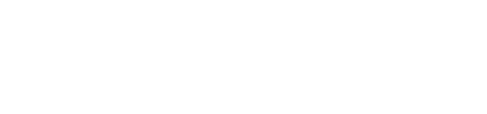
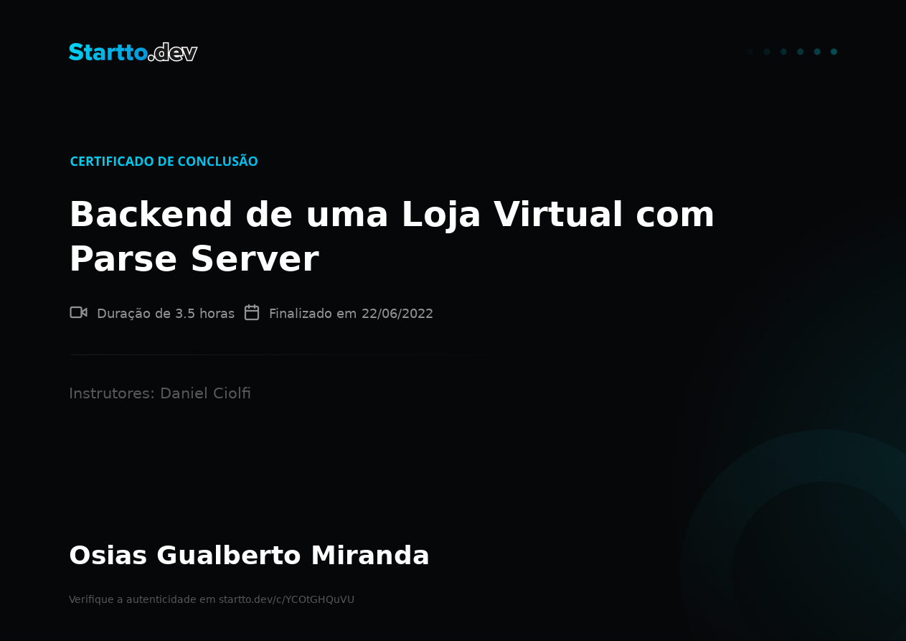

<h1 align="center">
    
    
</h1>
<h1 align="center"> 
	  

  
</h1>

<p align="center">  
  <a href="https://github.com/osiasmiranda">
    
  </a>
  
</p>

<p align="center">
 <a href="#-sobre-o-projeto">Sobre</a> •
 <a href="#-tecnologias">Tecnologias</a> •
 <a href="#-como-executar-o-projeto">Como executar</a> •
 <a href="#-como-executar-o-projeto">Certificado</a> •
 <a href="#-autor">Autor</a> • 
 <a href="#-user-content--licença">Licença</a>
</p>

## 💻 Sobre o projeto

<sub>
<a href="https://youtu.be/vLfIDscFgQI?list=PL_lJrbgUtzded_bF8KVl_puWZ-zDCLw7R">

</a> 
</sub>
->é uma plataforma de código aberto (baseada na Parse Platform ), plataforma de baixo código que ajuda você a desenvolver aplicativos modernos. No Back4App

## você encontrará os seguintes recursos: 
- [x] Armazenamento de dados (relacional)
- [x] Funções do Cloud Code
- [x] APIs (GraphQL e REST)
- [x] Armazenamento de arquivo
- [x] Autenticação
- [x] Notificações via push

Projeto desenvolvido no treinamento <a href="https://www.startto.dev/">**BACKEND DE UMA LOJA VIRTUAL COM PARSE SERVER - STARTTO.DEV**</a> do  professor Daniel Ciolfi.

---

## 🛠 Tecnologias

- [x] VSCODE
- [x] NODE
- [x] back4app
- [x] Git
- [x] Github

---


## 🚀 **Como executar o projeto**

É necessário ter o editor de código Vscode:

```bash
#Possuir uma conta no site do Back4app
  https://www.back4app.com/

#Criar um app no aplicativo - caso dúvidas assistir as aulas
#introdução ao Parse Server
  https://www.youtube.com/user/danielciolfi/videos
  
# Clone este repositório
 https://github.com/osiasmiranda/backend_lojavirtual_parseserver

# identificar o application id no arquivo .parse.local 
 {
  "applications": {
    "_default": {
      "link": "minimarket"
    },
    "minimarket": {
      "applicationId": "APPLICATION_ID"
    }
  }
}


```
## 🏆 Certificado

<h1 align="center">
    
    
</h1>

---

## 🦸‍♂️ **Autor**

<a href="https://github.com/osiasmiranda">
 
 <br />
 <sub><b>Osias Miranda</b></sub></a> <a href="https://github.com/osiasmiranda" title="githubosias">🚀</a>

Feito por Osias Miranda 👋🏽 Entre em contato!

[](https://www.linkedin.com/in/osias-miranda-57b67a4b/)
[](mailto:osiasmiranda@gmail.com)

---

## 📝 Licença


Este projeto esta sobe a licença [MIT](./LICENSE).